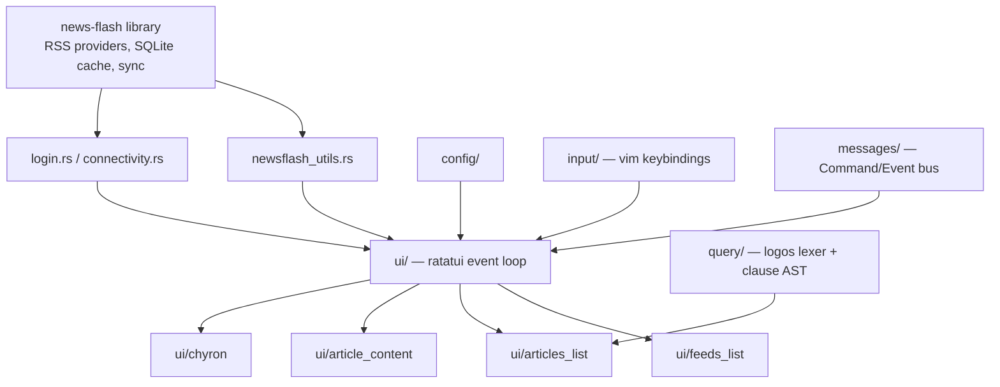
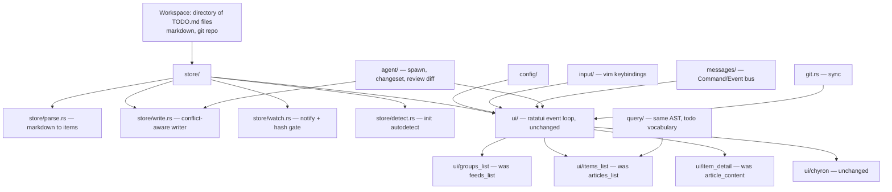
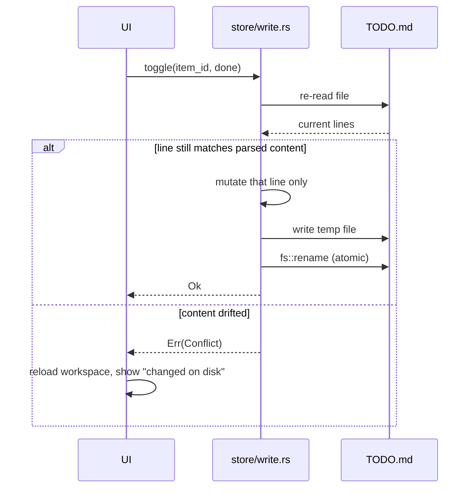
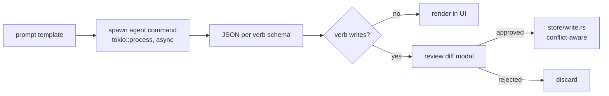

# mitodo — Design

**Date:** 2026-07-28
**Status:** Draft for review
**Lineage:** Hard fork of [christo-auer/eilmeldung](https://github.com/christo-auer/eilmeldung) v1.1.0 (GPL-3.0-or-later)

---

## 1. What this is

A TUI todo tracker over plain markdown checklists. It reads a directory of
`TODO.md` files, renders them in a three-pane terminal UI with vim keybindings
and a query language, and writes changes back to the source markdown without
reformatting it.

The name is Spanish — *mi todo*, "my everything" — and contains the word
"todo" literally, so it stays self-explanatory to readers who don't speak
Spanish.

**Why a fork rather than a new project.** eilmeldung is a mature ratatui
application whose RSS-specific surface is smaller than it looks: 29 of 49
source files reference `news_flash`, but the references concentrate in five
files and the rest are type imports. Everything that makes a TUI pleasant —
the async event loop, the keybinding engine, the query lexer and clause AST,
config loading, modals, popups, the command line, zen mode, the chyron ticker —
is domain-agnostic and already works. Rebuilding that under a permissive
licence would cost weeks before the first screen rendered.

**Licence consequence.** eilmeldung is GPL-3.0-or-later, so mitodo is too. This
blocks exactly one thing: shipping mitodo inside a proprietary product. That
is not a goal. If the markdown parse/write engine later deserves a permissive
release, it can be extracted — that code is authored fresh here (ported from
the author's own `todos-mcp`), not derived from eilmeldung, so it can be
relicensed at will.

---

## 2. Scope

### In scope for v1

Feature parity with the existing private `mcli run -g todos` command, which is
the tool this replaces:

| `mcli todos` today | mitodo v1 |
|---|---|
| `list` — Textual TUI, one tab per account | three-pane TUI, group tree in left pane |
| checkbox toggle, nested sub-items | items list with fold/unfold |
| `a` add, `e` edit, `d` delete + confirm | same keys |
| `i` info — description blockquote editor | detail pane, editable |
| `h` hide done | `h`, and the query `!done` |
| `s` git sync | `s` |
| settings persistence (theme, hide-done) | config file |
| `act` — resolve loop with `-p` / `-a` filters | subsumed by the query language |
| `scan` — LLM proposes a change-set | generic agent subsystem |
| `--root`, `--priority`, `--account` | CLI flags plus query |

### Out of scope for v1

Due dates and recurrence; sync providers; todo.txt and taskwarrior backends;
multiple simultaneous workspaces; a plugin API; mobile. None of these block
daily use, and each is additive later.

---

## 3. Architecture

### Before — eilmeldung



### After — mitodo



### Module disposition

| eilmeldung module | fate |
|---|---|
| `newsflash_utils.rs`, `login.rs`, `connectivity.rs` | delete |
| `ui/feeds_list` | becomes `ui/groups_list` — group/section tree |
| `ui/articles_list` | becomes `ui/items_list` — checkbox list |
| `ui/article_content` | becomes `ui/item_detail` — description, children, notes |
| `ui/chyron`, `ui/help_popup`, `ui/command_input`, `ui/command_confirm`, `ui/tooltip` | keep as-is |
| `query/` | keep AST and lexer, swap field vocabulary and filter predicate |
| `config/`, `input/`, `messages/`, `utils/` | keep, adjust types |
| `cli.rs`, `main.rs`, `ui/mod.rs` | heavy edit — startup and wiring |
| — | add `store/`, `agent/`, `git.rs` |

### Dependency change

Removed: `news-flash`, `openssl` (vendored — the build-time tentpole),
`reqwest`, `if-watch`, `image`, `ratatui-image`, `htmd`, `htmlescape`,
`text-splitter`.

Added: `notify` (file watching), `similar` (change-set diff rendering).

Everything else stays, including `tui-tree-widget` (group tree), `logos`
(query lexer), `fuzzy-matcher`, `termimad`, `tui-markdown`,
`throbber-widgets-tui` (agent progress), `arboard`, `webbrowser`.

---

## 4. Data model

Items form a tree, but are stored in a flat arena with parent and child
indices. This suits Rust's ownership rules and matches how ratatui renders the
list — flattened, with indentation.

```rust
struct Item {
    id: ItemId,             // content hash; a text edit yields a new id
    file: PathBuf,
    line: usize,            // 0-based line in the source file
    indent: usize,
    done: bool,
    text: String,
    description: String,    // the indented "> note" blockquote lines
    section: String,        // the "## " heading above it
    heading: String,        // the "### " heading above it
    priority: Priority,     // derived per config
    parent: Option<ItemId>,
    children: Vec<ItemId>,
}

struct Group {              // one account, project, or context
    name: String,
    todo_file: PathBuf,
    notes_file: Option<PathBuf>,
    archive_dir: Option<PathBuf>,
}
```

A group is the left-pane top-level node. Under `group_by = "directory"` each
group owns a distinct `todo_file`. Under `group_by = "heading"` every group
shares the same `todo_file` and is distinguished by its `## ` heading, with
`notes_file` and `archive_dir` unset. The rest of the system does not care
which mode is active.

```rust

struct Workspace {
    root: PathBuf,
    config: Config,
    groups: Vec<Group>,
    items: Vec<Item>,
}
```

`ItemId` is a content hash, matching the scheme used by the author's
`todos-mcp` server. Both tools therefore agree on item identity, and a
text-changing edit invalidates the old id in both.

`Priority` is `P0 | P1 | P2 | P3 | None`, derived from whichever source the
config names.

---

## 5. Store — concurrent writers are the hard constraint

The workspace is written by four independent actors: mitodo, the `mcli todos`
command, the `todos-mcp` server, and Claude editing files directly. mitodo
must never clobber another writer's change, and must never reformat a line it
did not touch.

### Write protocol

Every mutation re-reads the file and verifies the target line still holds the
content that was parsed, before writing.



A conflict is a normal, recoverable outcome shown in the status bar — not an
error dialog and never a panic.

### Watching

`notify` with a 200ms debounce, plus a file-hash gate so mitodo's own writes
do not trigger a reload loop. This mirrors what `todos-mcp` already does.

### No index

Items are parsed into memory on load and on change. A workspace of a few
hundred items across a handful of groups parses in microseconds. Adding
SQLite would duplicate `todos-mcp`'s FTS5 index and create a second source of
truth for no measurable gain.

### Format preservation

The writer's contract: after any mutation, every line the user did not edit is
byte-identical to what was there before. This is the single most important
property in the system — it is what makes concurrent editing by four tools
safe — and it is the focus of the test suite.

---

## 6. Configuration and `mitodo init`

Detection runs once, at `init`, and writes an explicit config file. Nothing is
inferred at runtime, so behaviour is always readable from the config rather
than reverse-engineered from heuristics.

```
$ mitodo init ~/repos/TODO
  scanning...
  ✓ 7 group directories, pattern */TODO.md
  ✓ priorities from "## " headings (P0–P3)
  ✓ notes.md sidecars, _archive/ directories
  ✓ git repository → sync enabled
  write ~/.config/mitodo/config.toml? [Y/n]
```

Resulting config:

```toml
[workspace]
root        = "~/repos/TODO"
group_by    = "directory"     # or "heading" for a single-file workspace
todo_glob   = "*/TODO.md"
notes_glob  = "*/notes.md"
archive_dir = "_archive"

[priority]
source  = "heading"           # "heading" | "tag" | "none"
pattern = "^P([0-3])"

[git]
enabled = true
sync    = [
  ["add", "-A"],
  ["commit", "-m", "mitodo: sync"],
  ["pull", "--rebase"],
  ["push"],
]
```

### Detection heuristics

| signal | inference |
|---|---|
| todo files found in subdirectories | `group_by = "directory"` |
| a single todo file at the root | `group_by = "heading"` |
| `## ` headings match `P[0-3]` | `priority.source = "heading"` |
| items carry `(A)` / `!!` / `@tag` markers | `priority.source = "tag"` |
| neither | `priority.source = "none"` |
| `notes.md` beside a todo file | notes sidecar enabled |
| `_archive/` directory present | archive path recorded |
| `.git` at the root | git sync enabled |

---

## 7. Query language

eilmeldung's `QueryAtom` / `QueryClause` AST, lexer, and combinators are
domain-agnostic. Only the field vocabulary and the filter predicate change.

```
acct:lefv              group / account
pri:P0    pri:<=P1     priority
done      !done        completion
sec:"P1 — High"        section heading
has:desc               has a description blockquote
text:"onehouse"        substring
onehouse               bare word — fuzzy match
sort:pri,text          ordering
AND  OR  NOT  ( )      combinators, inherited unchanged
```

This is what retires `mcli todos act`: its `-p P0 -a lefv` filters become
`pri:P0 acct:lefv !done`, and its interactive resolve loop becomes that view
plus the toggle key.

---

## 8. User interface

```
┌─ ~/repos/TODO · 41 open · pri:P0 !done ────────────────────┐
├──────────────┬─────────────────────────────────────────────┤
│ ▾ lefv     8 │ ☐ File 83(b) election for Onehouse          │
│ ▾ jzlaw   12 │   ☐ pull signature page                     │
│   ▾ P0     3 │   ☑ confirm 30-day window                   │
│   ▾ P1     9 │ ☐ Respond to opposing counsel re: discovery │
│ ▸ lysk     4 ├─────────────────────────────────────────────┤
│ ▸ personal 9 │ File 83(b) election for Onehouse            │
│              │ > due within 30 days of grant. Need CPA     │
│              │ > sign-off before mailing certified.        │
├──────────────┴─────────────────────────────────────────────┤
│ :add "call CPA"                                            │
│ ⣟ agent: scanning…          P0 · 83(b) due Fri · Discovery │
└────────────────────────────────────────────────────────────┘
```

Top bar shows workspace, open count, and active query. The command line
appears on `:`. The bottom line is the status bar, which the chyron takes over
when enabled — a scrolling ticker of P0 and overdue items, inherited from
eilmeldung's existing chyron implementation.

### Keybindings

eilmeldung's vim base, with `mcli todos`' letters preserved wherever they do not
clash, so muscle memory carries over.

| key | action | key | action |
|---|---|---|---|
| `j` `k` `g` `G` | navigate | `d` | delete, with confirmation |
| `space` / `x` | toggle done | `h` | hide done |
| `a` / `A` | add sibling / child | `s` | git sync |
| `e` | edit item text | `/` | search |
| `i` / `Enter` | focus detail pane | `:` | command line |
| `za` / `zc` | fold / unfold subtree | `?` | help popup |
| `z` | zen mode | `q` | quit |

---

## 9. Agent subsystem

The existing `scan` command shells out to `claude --print` with a JSON schema
and applies the returned change-set. Generalised, that is: *run an external
command with a prompt, receive structured JSON, render it or apply it after
review*. Four verbs share that one pipeline.



| verb | schema | writes |
|---|---|---|
| `nl → query` | `{ query: string }` | no — fills the query bar and shows the query it built |
| `summarize` | `{ brief: string }` | no — themes, what is stale, what blocks what |
| `breakdown` | `{ sub_items: [string] }` | yes — one item, nested children, reviewed |
| `scan` | existing `SCAN_SCHEMA` | yes — multi-file change-set, reviewed diff |

```toml
[agent]
command      = ["claude", "--print", "--dangerously-skip-permissions"]
schema_flag  = "--json-schema"
timeout_secs = 300

[agent.prompts]
scan = "~/.config/mitodo/prompts/scan.md"
```

The command is any binary that accepts a prompt and emits JSON — `claude`,
`codex`, a local `ollama` wrapper. mitodo ships generic prompt templates; the
author's version of `scan`, which names specific email accounts, stays a local
override. No email code and no provider coupling enter the repository.

Agent invocation is async and never blocks the UI; progress shows in the
status bar via the existing throbber widget.

---

## 10. Git sync

`s` runs the configured command list by shelling out to `git`, with output
streamed to a modal. No libgit2 dependency. The command list is
user-configurable and the whole feature is disableable, since not every
workspace is a repository.

---

## 11. Errors

`thiserror` for typed errors, `color-eyre` for reports — both already present.
Two failure modes are expected rather than exceptional, and both surface in
the status bar with the UI remaining usable:

- **Conflict** — a file changed underneath a write. Reload and inform.
- **Agent failure** — non-zero exit, timeout, or unparseable JSON. Report the
  first line of stderr and discard the result.

---

## 12. Testing

| area | test |
|---|---|
| parser | golden fixtures — `TODO.md` in, expected item list out |
| writer | **round-trip byte-equality**: mutate one line, assert every other byte is unchanged |
| writer | conflict simulation — mutate the file between parse and write, assert `Err(Conflict)` |
| query | parse and filter over a fixture workspace |
| detect | fixture workspaces of each supported shape produce the expected config |
| agent | schema validation against recorded JSON responses; malformed input is rejected cleanly |

The writer round-trip test is the one that matters most; format preservation
is what makes four concurrent writers safe.

---

## 13. Build order

1. `store/parse.rs` plus golden tests — no UI, prove the model against the
   real `~/repos/TODO` workspace.
2. `store/detect.rs` and `mitodo init` — config generation.
3. Strip news-flash: delete the three dead modules, get `cargo build` green
   with a stub store.
4. Wire `groups_list` and `items_list` to the store — read-only browse.
5. `store/write.rs` plus round-trip and conflict tests; toggle, edit, add,
   delete.
6. Query vocabulary swap.
7. `item_detail` pane, description editing.
8. `store/watch.rs` — live reload.
9. `git.rs` — sync.
10. `agent/` — the four verbs and the review diff.
11. Chyron vocabulary swap; README, licence attribution, packaging.

All eleven steps are v1 — v1 is defined as parity with `mcli run -g todos`,
which includes `scan`. Steps 1–5 are the first internally usable milestone,
at which point the tool can replace daily browsing and toggling; steps 6–11
close the remaining parity gap. The ordering exists so that a foundational
mistake in the store surfaces before any UI work depends on it.

---

## 14. Attribution

README and a `NOTICE` file credit christo-auer/eilmeldung, state the GPL-3.0
lineage, and link upstream. The `upstream` git remote is retained so eilmeldung's
TUI fixes can be cherry-picked.
